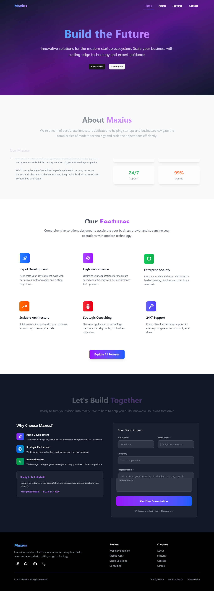

# Maxius - Modern Landing Page

A sleek and modern landing page built with Next.js, featuring smooth animations and responsive design.

## 🌟 Features

- Modern, clean design with smooth animations
- Fully responsive layout
- Optimized performance with Next.js
- Smooth scrolling effects
- Interactive navigation
- Contact form integration
- SEO optimized

## 📷 Screenshots


*Full page view of the Maxius landing page*

## 🚀 Getting Started

### Prerequisites

- Node.js 18+ 
- npm, yarn, pnpm, or bun

### Installation

1. Clone the repository:
```bash
git clone <repository-url>
cd maxius
```

2. Install dependencies:
```bash
npm install
# or
yarn install
# or
pnpm install
```

3. Run the development server:
```bash
npm run dev
# or
yarn dev
# or
pnpm dev
# or
bun dev
```

4. Open [http://localhost:3000](http://localhost:3000) in your browser.

## 🛠️ Built With

- [Next.js](https://nextjs.org/) - React framework
- [TypeScript](https://www.typescriptlang.org/) - Type safety
- [Tailwind CSS](https://tailwindcss.com/) - Styling
- [Lucide React](https://lucide.dev/) - Icons
- [Framer Motion](https://www.framer.com/motion/) - Animations

## 📂 Project Structure

```
maxius/
├── src/
│   ├── components/     # Reusable components
│   ├── hooks/         # Custom hooks
│   ├── types/         # TypeScript types
│   └── constants/     # Application constants
├── public/            # Static assets
└── ...
```

## 🎨 Customization

You can customize the landing page by modifying:

- `src/constants/index.ts` - Application data and content
- `src/components/` - Individual components
- `tailwind.config.ts` - Styling configuration

## 📱 Demo

🔗 **Live Demo:** [https://landing-page-nhtam.vercel.app/](https://landing-page-nhtam.vercel.app/)

Check out the live version of the Maxius landing page to see all features in action.

## 🤝 Contributing

Contributions are welcome! Please feel free to submit a Pull Request.

## 📄 License

This project is licensed under the MIT License.

## 📧 Contact

For any questions or suggestions, please reach out via the contact form on the website.
